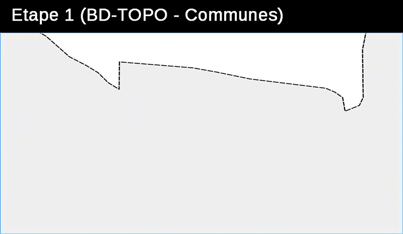

*Le [projet original][origin] est hébergé sur [l'instance gitlab de Framasoft][framagit]. D'autres versions peuvent être déployées, notamment sur gitlab ou github, mais il s'agit de mirroirs...*

# OSCom - un Observatoire des Sols Communal
L'**outil Observatoire des Sols à l’échelle communale** (OSCom) permet d’avoir rapidement une vision de l’occupation des sols et une approche de l’évolution de la consommation de l’espace à partir d'un traitement informatique des bases de données existantes dans les DRAAF, DREAL et DDT(M) : BD top, RPG, BD forêt,
MAJIC (traitement CEREMA).

La version actuelle permet de connaître la répartition des surfaces selon une nomenclature compatible avec le "Mode d'occupation des Sol" (MOS) ou Corine Land Cover.
Elle permet d'effectuer
* des analyses sur une commune, un canton, un SCOT, un EPCI et aussi sur un ensemble personnalisé de communes,
* des comparaisons entre 2 millésimes (l'année la plus ancienne étant 2009 pour la Normandie),
* d'obtenir l'évolution sur un périmètre d'un code de la nomenclure (variation des prairies par exemple),
* d'extraire les tableaux ou cartes par simple copier coller pour les insérer dans des rapports,
* de retravailler la cartographie à partir des tables personnalisées générées en se connectant avec QGIS sur la base de données Postgresql,
* d'exporter des données surfaciques.

Il a vocation à évoluer à l’initiative de la DRAAF Normandie qui assurera chaque année la production des nouveaux millésimes. Un [document de synthèse][synthese] (14 Mo), également disponible sur le site [Valor][valor] avec d'autres éléments techniques et notamment un *pack de portabilité*, explique la démarche et le fonctionnement général.

## Installation (bonne chance!)
*instructions à mettre en place*

## Pré-requis (à compléter)
* serveur *type de serveur?* avec
 * PHP *version nécessaire?*
  * MapServer
  * *modules indispensables éventuels*
 * Postgresql *9.3 et plus*
  * PostGIS *2.1 et plus*

## Licence
*la licence n'est pas choisie à ce jour. Une réflexion est en cours*

## Crédits
Le projet utilise
* [normalize.css](http://necolas.github.io/normalize.css) *4.1.1*
* [jQuery](http://jquery.com/) *1.12.0*
* ... (autres? *compléter le cas échéant*)

Imaginé, construit et mis en oeuvre par
* Xavier Leclair (DRAAF Normandie)
* Michel Delacroix (DRAAF Normandie)
* Fouad Gafsi (DDTM Seine-Maritime)
* Hamidou Diop (DDTM Seine-Maritime)

## Circuit
* **[Framagit][origin]** ([issues][issues])
   * [Gitlab][gitlab]
      * [Github][github]

[origin]:https://framagit.org/know-rmandie/OSCom
[synthese]:doc/synthese-OSCom-20160203.pdf
[issues]:https://framagit.org/know-rmandie/AGENor/issues

[valor]:http://valor.national.agri/R23-01-Haute-Normandie-Occupation?id_rubrique=187
[framagit]:https://framagit.org
[gitlab]:https://gitlab.com/know-rmandie/OSCom
[github]:https://github.com/know-rmandie/OSCom
